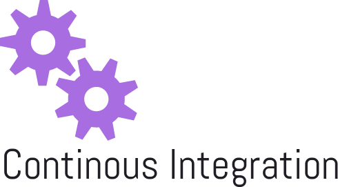

Docker
=======
Docker/Docker-compose, jenkins config and other scripts to get a working "Ontwikkel straat"

CI
==
Continous Integration
  * docker-compose to start an ci build environment with [jenkins](https://jenkins.io/), [sonar](http://www.sonarqube.org/), [Hygieia](https://github.com/capitalone/Hygieia), [nexus](http://www.sonatype.org/nexus/) and [Gogs](https://gogs.io/).

Notes:  
  * Hychieia, afther initial docker-compose up, or if you run the images standalone, the mongo database needs an database user.
  * Gogs, configure gogs to use a postgresql database on host gogsdb with user gogs and password gogs.

Urls
==
* jenkins http://localhost:8081
* hygieia-api http://localhost:8082
* nexus http://localhost:8083
* gogs http://localhost:8084
* hychieia-ui http://localhost:8085
* sonar http://localhost:9000


CI-Hychieia
==

Adding a database user to the mongo database.
* Bring up the container images

```bash
docker-compose up -d
```

  * Create user in mongo

```bash
docker exec -t -i mongodb bash
```

  * Run the following commands as shown below at mongodb command prompt

```bash
         $ mongo  
         MongoDB shell version: 3.0.4
         connecting to: test  

         > use dashboard
         switched to db dashboard
         > db.createUser(
                  {
                    user: "db",
                    pwd: "dbpass",
                    roles: [
                       {role: "readWrite", db: "dashboard"}
                            ]
                    })
                Successfully added user: {
                  "user" : "dbuser",
                  "roles" : [
                  {
                    "role" : "readWrite",
                    "db" : "dashboard"
                  }
                  ]
                }  
```
